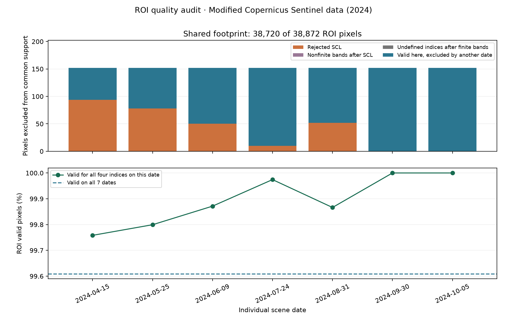

# Satellite Crop Monitoring

Seven real Sentinel-2 observations reveal the seasonal evolution of an Iowa agricultural landscape on a consistent, cloud-masked 20 m grid.


## Problem and scope

Comparing satellite dates is misleading when cloud masks, resolution or reflectance calibration change. This pipeline preserves a common spatial footprint and records those choices. It is descriptive monitoring, with no trained stress detector, crop classification or yield prediction. No field observations or crop-parcel labels are available.

## Dataset

Seven Sentinel-2 Collection-1 Level-2A scenes, April–October 2024, from [Earth Search](https://earth-search.aws.element84.com/v1), collection `sentinel-2-c1-l2a`. WGS84 area: `[-94.50, 41.40, -94.46, 41.44]`. The [frozen manifest](data/scene-manifest.json) retains complete source asset URLs and calibration. Select the lowest scene-cloud-cover eligible observation per month; these are individual observations, not monthly composites. Discovery found 44 eligible items; selection uses cloud metadata, never index values.

Code is MIT. Source data have [Copernicus Sentinel terms](https://dataspace.copernicus.eu/terms-and-conditions); they are not relicensed MIT or CC BY. Attribution: **Modified Copernicus Sentinel data (2024)**. See [data provenance](data/README.md).

## Workflow

```text
Frozen public STAC items → HTTPS COG windows → common 20 m grid
→ reflectance calibration → SCL quality mask → four indices
→ common valid footprint → GeoTIFFs, CSV, maps and provenance
```

Continuous bands use bilinear resampling; categorical SCL uses nearest neighbour. STAC metadata specify scale `0.0001`, offset `-0.1`, raw nodata `0`; relying on Rasterio defaults would omit calibration. Arithmetic uses float64 before float32 storage to avoid masking zero reflectance due to rounding. SCL classes 4/5/6 are admitted, including water and nonvegetated land. Cloud, shadow, snow, unclassified and nodata pixels are excluded. Negative reflectance and nonpositive index denominators are conservatively masked.

| Index | Definition | Interpretation |
|---|---|---|
| NDVI | (NIR − red)/(NIR + red) | Greenness |
| NDWI, McFeeters | (green − NIR)/(green + NIR) | Water contrast; different from NDMI |
| NDMI | (NIR − SWIR1)/(NIR + SWIR1) | Moisture-sensitive spectral contrast |
| SAVI | 1.5 × (NIR − red)/(NIR + red + 0.5) | Soil-adjusted greenness |

## Executed results

The projected grid is EPSG:32615, 172 × 226 pixels at 20 m. The common valid footprint contains **38,720 pixels (99.61%, 1548.80 ha)**. See [all observed values](reports/time-series.csv) and [execution manifest](reports/run-manifest.json).


The curves summarize the same pixels at every date. Shading is the spatial 10–90% range, not confidence intervals. A seasonal rise and decline in greenness is consistent with changing vegetation cover, but these data alone do not identify crops or diagnose drought. Scene cloud percentage describes the full source tile; ROI coverage is calculated independently.

## ROI quality and shared support

`python -m satellite.cli quality` audits existing scene caches and index GeoTIFFs without downloading new data or replacing the original reports/rasters. Run the original pipeline first if those ignored local inputs are absent. The audit rejects stale cache fingerprints/hashes, mismatched shapes/georeferencing, or masks/common support that differ from historical evidence.

Each ROI partitions exactly into rejected SCL, allowed SCL with nonfinite calibrated bands, undefined indices after finite bands, and scene-valid pixels. Scene-valid pixels then split into common support and valid pixels excluded because another date is invalid. Per-band/per-index diagnostic counts can overlap; they must not be added as independent losses. All twelve SCL class counts, actual cache hashes and validity fractions are recorded in [CSV](reports/scene-quality.csv) and [JSON](reports/scene-quality.json). Hectares use the affine pixel area only after confirming a projected metre CRS.

| Scene date | Rejected SCL pixels | Scene-valid pixels | Valid here but outside common support |
|---|---:|---:|---:|
| 2024-04-15 | 94 | 38,778 | 58 |
| 2024-05-25 | 78 | 38,794 | 74 |
| 2024-06-09 | 50 | 38,822 | 102 |
| 2024-07-24 | 10 | 38,862 | 142 |
| 2024-08-31 | 52 | 38,820 | 100 |
| 2024-09-30 | 0 | 38,872 | 152 |
| 2024-10-05 | 0 | 38,872 | 152 |

In this executed audit, nonfinite-band and undefined-index exclusions are both zero after the preceding filters. All 38,720 historical common pixels match, giving 99.60897% support and 1548.80 ha on the verified 20 m UTM grid. September and October have entirely valid ROIs but still lose 152 pixels when comparing all seven dates. This measures consistent data support; it does not validate SCL classification, crop identity or physiological stress. Test fixtures are synthetic; reported scene counts come from the actual cached observations.



## Run locally

Python 3.12 is required. Clone the linked public repository or use its source archive.

```bash
python -m venv .venv
# Activate .venv using your platform's command.
python -m pip install -r requirements-lock.txt
python -m pip install --no-deps -e .
python -m satellite.cli run
python -m satellite.cli quality
python -m pytest -q
python -m ruff check .
```

No API token or paid account is needed. The first run reads public COG windows; later runs use ignored ROI caches. Source imagery and generated GeoTIFFs remain local under `data/raw` and `data/processed`. A changed manifest, configuration or calibration fingerprint raises an error rather than silently reusing stale cache. Remove only obsolete cache files explicitly.

`python -m satellite.cli discover` prints newly discovered scene IDs without modifying the frozen study. Inspect [the executed notebook](notebooks/01_inspection.ipynb), [verification](docs/verification.md), [French learning guide](docs/learning-guide.md), [interview notes](docs/interview-notes.md) and [design](docs/design.md).

## Structure and technologies

`src/satellite`: catalog, raster alignment, indices, pipeline and CLI. `configs`: study parameters. `data`: frozen metadata and ignored imagery. `reports`: actual statistics and figures. `tests`: numeric, mask, grid and GeoTIFF contracts. Python, NumPy, pandas, Rasterio/GDAL, matplotlib, pytest and GitHub Actions.

## Limitations and next work

Seven carefully selected clear observations undersample rapid events and do not measure monthly means. A rectangular landscape is not a crop-only mask; SCL can misclassify and bilinear resampling mixes boundaries. Sentinel reflectance and indices are proxies, not physiological measurements. Add independent parcel/crop labels, additional years and field measurements before interpreting crop-specific anomalies. No accuracy metric is applicable because there is no labeled prediction task.

Developed with AI assistance. Results come from executed public data, with no invented observations or backdated history. Actual GitHub CI is linked below; passing software checks do not establish field validity.


## GitHub publication

[Public repository](https://github.com/idrisslemnouni-crypto/satellite-crop-monitoring) · [Current CI results](https://github.com/idrisslemnouni-crypto/satellite-crop-monitoring/actions). Published following the user's explicit 5 October 2026 request to release the prepared portfolio together. Earlier local-verification notes describe the pre-publication checkpoint. Raw sources and trained artifacts remain excluded from Git; reproduction commands regenerate them.
